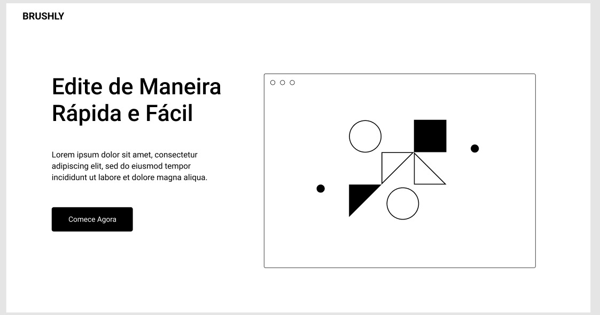
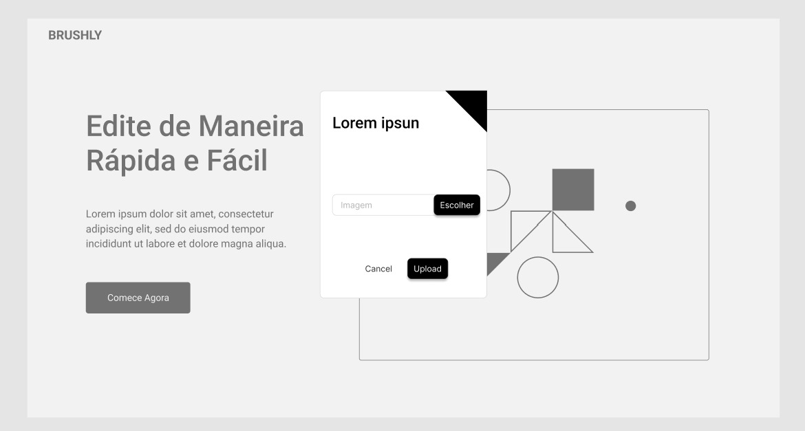
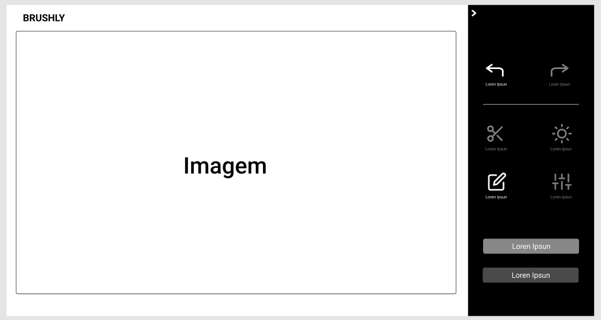
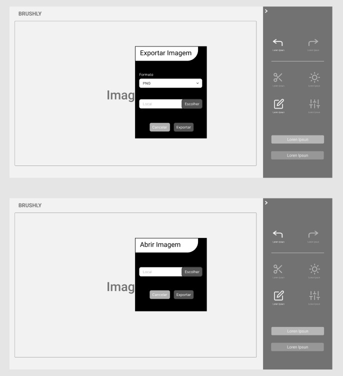

# Projeto de Interface

O  brushly se destaca no diferencial da simplicidade que o usuário irá ter na hora de realizar a edição de uma imagem, pensando nesse quesito foi implementado uma interface de fácil compreensão para que todos tenham a facilidade de realizar qualquer tipo de execução dentro da ferramenta.

## User Flow

Como uma interface de fácil uso, nada mais justo o que basear se em um userflow de fácil compreensão. 

## Wireframes

Começamos com um Wireframe que apresenta inicialmente a ferramenta com a opção Comece Agora, padrão das ferramentas de edição. 

Logo após selecionarmos a opção, nos é mostrado uma caixa de seleção de imagem simples, o intuito é a própria ferramenta Brushly importar a imagem e suas predefinições mesmo em alta qualidade de maneira automática.  

Avançando mais um pouco temos a área onde será realizado as alterações nas imagens, nota se que temos as funcionalidades de maneira intuitivas sendo elas: corte e redimensionamento, alteração de brilho e contraste, sobreposição de texto, aplicação de filtros. Além dessas funcionalidades o brushly mantém um histórico de edição para ser possível desfazer alterações.

O Brushly também carrega a função de abrir uma nova imagem sobreposta e a opção de exportar a imagem ao fim da edição. 

Sendo assim o Brushly atende a todos os requisitos que um editor iniciante ou uma pessoa que necessita de opção simples possa precisar inicialmente.

[Link Figma](https://www.figma.com/design/gnWbYkxyCjp4jURSy1aEPN/Brushly---Etapa-2?node-id=0-1&t=EfJpJf7nD9gfVgxE-1)
